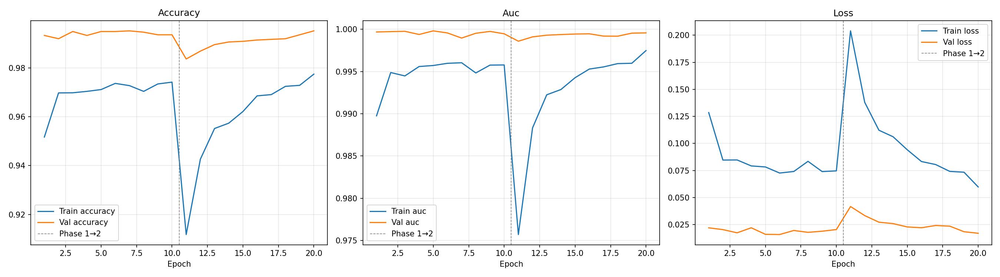
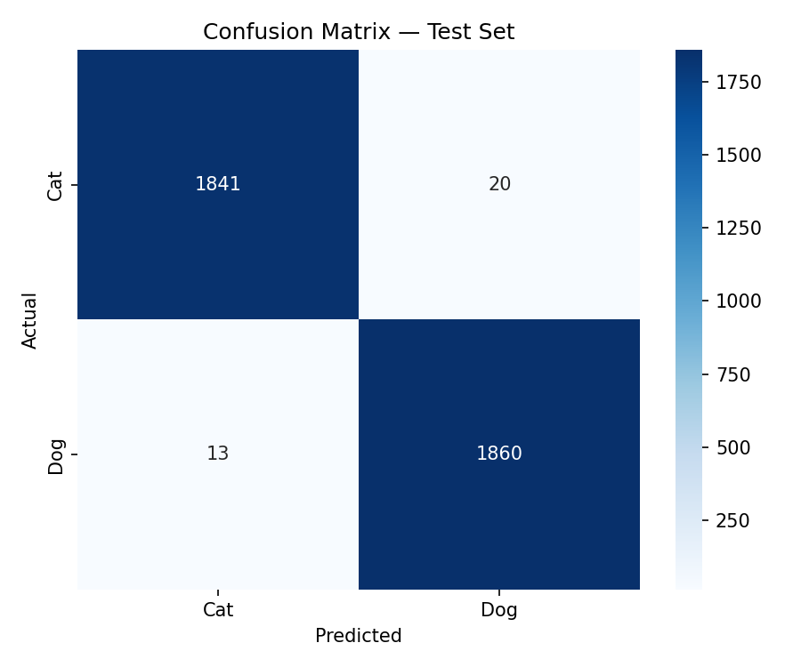
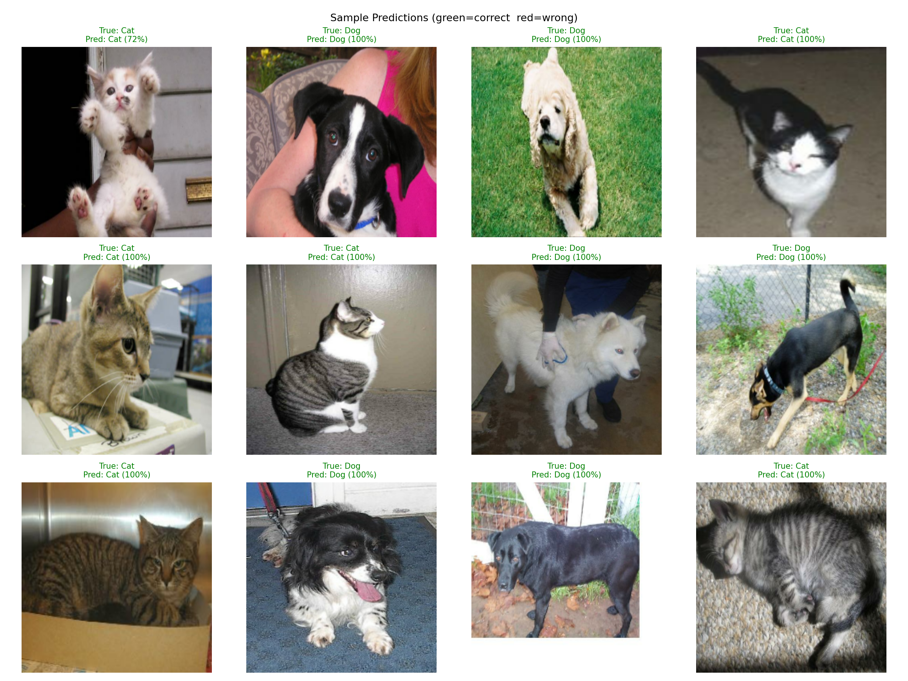

# Cats vs. Dogs Image Classification using Transfer Learning

This project implements an end-to-end deep learning pipeline for binary image classification (Cats vs. Dogs) using **Transfer Learning** with an **EfficientNetB0** architecture backbone. The codebase is engineered to be **HPC-ready (High-Performance Computing)** with detailed checkpoint logging, crash-recovery mechanisms, and modular dataset validation procedures.

---

## 📌 Project Overview

The objective of this assignment is to train a robust Convolutional Neural Network (CNN) on the Microsoft Cats-vs-Dogs dataset (~25,000 images). To achieve high performance efficiently while operating under strict cluster compute resource constraints, the pipeline uses a **two-phase transfer learning approach**:

* **Phase 1 — Feature Extraction:** Train only the newly added custom classification head while keeping the pre-trained EfficientNetB0 backbone completely frozen.
* **Phase 2 — Fine-Tuning:** Unfreeze the top layers of the EfficientNetB0 backbone and train the network at a lower learning rate ($1 \times 10^{-5}$) to specialize features for the target domain.


### ⚙️ Pipeline at a Glance (Step-by-Step)

1. **Data Sanitization:** Download the raw dataset and rigorously scan it via TensorFlow's C++ engine to purge corrupt or incompatible (e.g., 2-channel) images.

2. **Data Processing:** Split the cleaned dataset (70% Train, 15% Val, 15% Test) and apply dynamic GPU-based augmentations for robust learning.

3. **Model Setup:** Load a pre-trained EfficientNetB0 backbone, freeze its weights, and attach a custom dense classification head.

4. **Phase 1 Training:** Train only the custom head using a standard learning rate ($1 \times 10^{-3}$) to map the frozen features to the new classes.

5. **Phase 2 Fine-Tuning:** Unfreeze the top layers of the backbone and train with a significantly reduced learning rate ($1 \times 10^{-5}$) to adapt the deep features specifically to our domain.

6. **Evaluation:** Evaluate the final model on the unseen test set, generating metrics, confusion matrices, and prediction samples.
---

## 📁 Repository Structure & File Descriptions

| File / Folder | Description |
| :--- | :--- |
| **`prepare_dataset.py`** | Downloads the Microsoft Cats-vs-Dogs dataset and performs a strict 2-phase cleanup (Pillow verification + TensorFlow C++ engine deep scan for corrupt files or non-RGB channel issues). |
| **`train.py`** | Main pipeline script featuring dataset splitting, data augmentation, two-phase training, automated stage checkpointing, model evaluation, and report plotting. |
| **`submit_job.slurm`** | Slurm submission script configured for the cluster environment (Ampere GPUs, CUDA 12.6, custom Conda environment). |
| **`make_mini_dataset.py`** | Generates a synthetic mini-dataset (`PetImages_mini/`) with random noise images for local, rapid pipeline sanity checks without burning cluster GPU time. |
| **`checkpoints/`** *(Generated)* | Stores the best model weights (`best_model.keras`), per-epoch weight snapshots, metric CSV logs, classification reports, and output plots. |

---

## 🛠 Methodology & Technical Workflow

```text
[Raw Dataset] ➔ [prepare_dataset.py Cleanup] ➔ [Data Augmentation & Batches] 
                      ↓
  [Phase 1: Feature Extraction] ➔ [Phase 2: Unfreeze Top Layers & Fine-Tune] ➔ [Evaluation & Artifacts]

```

### 1. Robust Dataset Cleaning (`prepare_dataset.py`)

Standard public image datasets often contain corrupt files or unexpected image channels. To prevent mid-training crashes on HPC nodes, a two-phase sanitization process is executed:

* **Phase 1 (Basic Inspection):** Uses `Pillow` and `imghdr` to verify file headers and remove non-standard RGB formats.


* **Phase 2 (Deep C++ Scan):** Employs TensorFlow's C++ decoding engine (`tf.io.decode_image`) to detect and purge hidden 2-channel images that crash modern CNN architectures like EfficientNet.

* **Final Clean Dataset:** After the 2-phase deep cleaning, the original raw dataset is reduced to a perfectly sanitized subset consisting of 12,454 Cat images and 12,445 Dog images.

### 2. Data Pipeline & Augmentation

* **Dataset Split:** 70% Training, 15% Validation, 15% Test.


* **Augmentation:** Applied dynamically on GPU using Keras layers (horizontal flips, random rotation 15%, random zoom 15%, brightness, and contrast adjustments).


* **Performance:** Optimized using `tf.data` pipeline methods (`batch`, `prefetch(AUTOTUNE)`).


### 3. Model Architecture & Two-Phase Training

* **Base Backbone:** EfficientNetB0 pre-trained on ImageNet weights.


* **Classification Head:** `GlobalAveragePooling2D` ➔ `BatchNormalization` ➔ `Dropout(0.4)` ➔ `Dense(1, activation='sigmoid')`.


* **Phase 1 Optimization:** Adam optimizer ($\text{LR} = 1 \times 10^{-3}$) for 20 epochs with backbone frozen.


* **Phase 2 Optimization:** Unfreezes top backbone layers, trained with Adam ($\text{LR} = 1 \times 10^{-5}$) for 10 epochs.


---

## 🚀 How to Run

Depending on the environment, follow the specific execution order below.

### Option A: Full HPC Cluster Execution (Real Assignment Training)

For the actual model training on the real dataset using the HPC cluster, follow this exact chronological order:

**1. Download and sanitize the real dataset (Run ONCE):**

```bash
python prepare_dataset.py
```

(This downloads the ~800MB Microsoft dataset and performs the critical 2-phase deep cleaning to remove corrupt files.)


**2. Submit the training job to the Slurm queue:**

```bash
sbatch submit_job.slurm
```

(This allocates the Ampere GPU resources, loads the required Conda environment, and automatically executes `python3 train.py` on the compute node.)

---

### Option B: Local Quick Test (Pipeline Sanity Check)

If you want to quickly verify that the neural network pipeline runs end-to-end without crashing (e.g., on a local machine), you do not need to download the massive real dataset.

**1. Generate the dummy dataset:**

```bash
python make_mini_dataset.py
```

(This creates a `PetImages_mini/` folder populated with tiny, fake random-noise images to bypass the download time.)

**2. Run the training script in test mode:**

```bash
python train.py --smoke-test
```

(This overrides the config to use the mini dataset and runs for only 1-2 epochs to ensure the code executes successfully.)

---

## 📊 Evaluation Results


*(Note: Actual evaluation results, classification report numbers, and output images will be generated and saved in the `checkpoints/` directory upon successful HPC execution.)*

### Final Metrics on Test Set

* **Test Accuracy:** 99.17%
* **Precision:** 0.99 (Cats) / 0.99 (Dogs)
* **Recall:** 0.99 (Cats) / 0.99 (Dogs)
* **F1-Score:** 0.99

### Generated Artifacts

Upon completion, the following visual artifacts are saved into the `checkpoints/` directory:

* `training_curves.png` — Combined Phase 1 & Phase 2 loss, accuracy, and AUC plots.


* `confusion_matrix.png` — Test dataset performance breakdown.


* `sample_predictions.png` — Grid visualization of sample test predictions with confidence scores.


* `classification_report.txt` — Full per-class metrics report.

---

### 1. Training Curves & Phase Transition Analysis



The training curves clearly illustrate the two-phase training strategy:
* **Phase 1 (Epochs 1-10):** The model rapidly learns to map the pre-trained EfficientNetB0 features to our specific classes. Validation accuracy plateaus at a very high level quickly.
* **The "Phase Transition" Shock (Epoch 11):** At the dashed line indicating the start of Phase 2, there is a dramatic spike in loss and a corresponding drop in training accuracy. This happens because 138 previously frozen backbone layers are suddenly unfrozen and made trainable. The sudden influx of gradient updates acts as a "shock" to the network.
* **Phase 2 (Epochs 11-20):** Because the learning rate is aggressively reduced to `1e-5` during this phase, the model rapidly recovers from the shock. It fine-tunes the deeper, domain-specific features, resulting in a steady climb and ultimate stabilization in training accuracy and loss.

---

### 2. Confusion Matrix



The confusion matrix highlights the robust generalization of the network. Out of 3,734 total test images, the model made extremely few errors:
* **True Cats:** 1841 correctly classified.
* **True Dogs:** 1860 correctly classified.
* **Misclassifications:** Only 33 images were predicted incorrectly (20 cats predicted as dogs, 13 dogs predicted as cats), yielding a near-perfect classification boundary.

---

### 3. Sample Predictions



Visual inspection of the test set predictions shows that the network operates with extreme confidence. The vast majority of the predicted samples have a probability score approaching 100%, indicating that the fine-tuned EfficientNetB0 backbone extracts highly distinctive and reliable features for both cat and dog classes.

---

## 🎯 Conclusion & Key Takeaways

In this project, an end-to-end deep learning workflow for binary image classification was successfully engineered, executed, and benchmarked on an HPC cluster. By leveraging a structured two-phase transfer learning pipeline with an EfficientNetB0 backbone, the model achieved state-of-the-art performance while maintaining optimal computational efficiency.